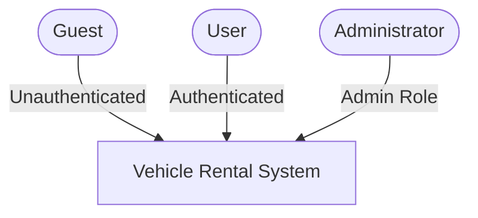
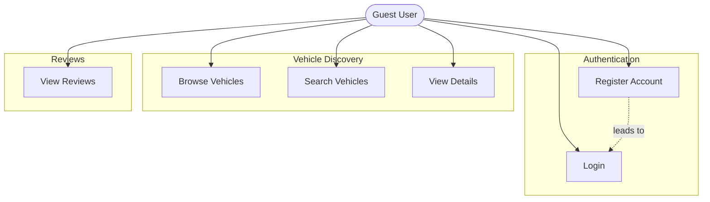
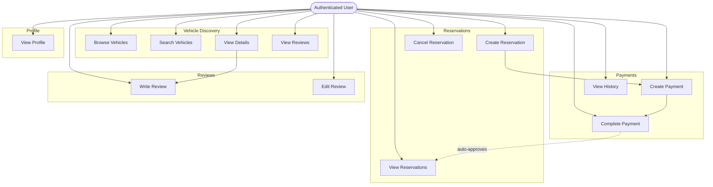
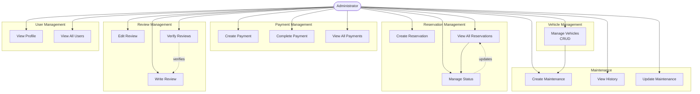

# Use Case Diagram - Vehicle Rental Management System

## System Overview

---

## Actors Overview

### 1. Guest (Unauthenticated User)
**Description:** A visitor to the system who has not yet logged in.

**Capabilities:**
- Register a new account
- Login to existing account
- Browse available vehicles
- Search vehicles with filters
- View vehicle details
- View vehicle reviews

---

### 2. User (Authenticated Regular User)
**Description:** A registered user with a USER role. Inherits all Guest capabilities.

**Additional Capabilities:**
- Create/manage own reservations
- Create/complete payments
- Write and edit own reviews
- View own profile

---

### 3. Administrator (Admin User)
**Description:** A privileged user with an ADMIN role. Inherits all User capabilities plus:

**Additional Capabilities:**
- Full vehicle CRUD operations
- Approve/reject any reservations
- View all user data (reservations, payments, users)
- Create and manage maintenance records
- Verify reviews

---

---

## Guest Use Cases

### Guest Use Case Diagram

### Guest Use Cases

**Goal:** Allow unregistered users to browse the system and register.

### UC1: Register Account
**Preconditions:** None  
**Postconditions:** User account created with USER role

1. Guest provides name, email, password
2. System validates inputs (email format, password ≥6 chars)
3. System checks email uniqueness
4. System hashes password and creates user with USER role
5. System generates JWT token and returns success

**Error Cases:**
- Invalid input format → 400 Bad Request
- Email already exists → 400 Bad Request

**Business Rules:**
- Email must be unique
- Default role is USER (admin accounts created manually)

---

### UC2: Login
**Preconditions:** User has registered  
**Postconditions:** JWT token received

1. Guest provides email and password
2. System validates inputs
3. System finds user and verifies password
4. System generates JWT token
5. System returns token

**Error Cases:**
- User not found → 400 "Invalid credentials"
- Password mismatch → 400 "Invalid credentials"

**Security:** Generic error message prevents email enumeration

---

### UC3: Browse Vehicles
**Preconditions:** None  
**Postconditions:** Vehicle list with pagination displayed

1. Guest requests vehicle list
2. System applies pagination (default: page=1, limit=10, max 100)
3. System retrieves vehicles ordered by creation date
4. System returns data with metadata

**Optional Filters:**
- Search term (marque/modele) - case-insensitive
- Status (etat)
- Price range (minPrice, maxPrice)

---

### UC4: Search Vehicles
**Preconditions:** None  
**Postconditions:** Filtered vehicle list displayed

1. Guest provides search criteria
2. System applies text search and filters
3. System applies pagination
4. System returns results

**Examples:**
- `?search=Toyota` → all Toyota vehicles
- `?etat=available&minPrice=30&maxPrice=100` → available vehicles in price range
- `?search=corolla&page=2` → paginated results

---

### UC5: View Vehicle Details
**Preconditions:** Vehicle exists  
**Postconditions:** Vehicle details displayed

1. Guest requests vehicle by ID
2. System validates ID
3. System retrieves and returns vehicle data

**Error Cases:**
- Vehicle not found → 404 Not Found

---

### UC7: View Vehicle Reviews
**Preconditions:** Vehicle exists  
**Postconditions:** Review list displayed

1. Guest views reviews for a vehicle
2. System returns all verified reviews with ratings
3. Display average rating and review count

---

## Authenticated User Use Cases

### User Use Case Diagram

### Authenticated User Use Cases

**Inherits all Guest capabilities plus:**

### UC8: Create Reservation
**Preconditions:** User authenticated, vehicle exists and available  
**Postconditions:** Reservation created with PENDING status

1. User provides vehicleId, startDate, endDate
2. System validates date range (startDate < endDate)
3. System checks vehicle existence and availability
4. System checks for conflicts with existing PENDING/APPROVED reservations
5. System calculates totalPrice = days × vehicle.prixJour
6. System creates reservation
7. System returns reservation details

**Error Cases:**
- Invalid dates → 400 Bad Request
- Date conflict → 400 "Vehicle already reserved"
- Vehicle not found → 404 Not Found

**Business Rules:**
- Price auto-calculated
- CANCELLED reservations don't block dates
- Users can only create for themselves (unless admin)

---

### UC9: View Reservations
**Preconditions:** User authenticated  
**Postconditions:** User's reservations displayed

1. User requests reservation list
2. System filters for user's own reservations (pagination applied)
3. System applies optional status filter (PENDING/APPROVED/CANCELLED)
4. System loads related vehicle and user data
5. System returns reservations with metadata

---

### UC10: Cancel Reservation
**Preconditions:** Reservation exists  
**Postconditions:** Reservation status changed to CANCELLED

1. User provides reservation ID
2. System validates user owns the reservation
3. System updates status to CANCELLED
4. System returns updated reservation

**Error Cases:**
- Reservation not found → 404 Not Found
- User doesn't own reservation → 403 Forbidden

---

### UC12: Create Payment
**Preconditions:** Reservation exists  
**Postconditions:** Payment created with PENDING status

1. User provides reservationId and amount
2. System validates inputs
3. System checks user authorization (owns reservation)
4. System validates amount matches reservation.totalPrice
5. System checks no completed payment exists
6. System creates payment record
7. System returns payment

**Error Cases:**
- Reservation not found → 404 Not Found
- Amount mismatch → 400 Bad Request
- Payment already completed → 400 Bad Request

---

### UC13: Complete Payment
**Preconditions:** Payment exists with PENDING status  
**Postconditions:** Payment marked COMPLETED, reservation auto-approved

1. User provides payment ID and optional notes
2. System validates user owns the payment
3. System updates payment:
   - status = COMPLETED
   - paidAt = current timestamp
   - notes = provided notes
4. System auto-approves linked reservation if PENDING
5. System returns updated payment

**Error Cases:**
- Payment not found → 404 Not Found
- User doesn't own payment → 403 Forbidden

**Business Rules:**
- Payment completion triggers auto-approval of reservation
- paidAt timestamp recorded for audit trail

---

### UC14: View Payment History
**Preconditions:** User authenticated  
**Postconditions:** User's payments displayed

1. User requests payment list
2. System filters for user's payments
3. System applies optional filters (status, reservationId)
4. System returns paginated results

---

### UC15: Write Review
**Preconditions:** Vehicle exists  
**Postconditions:** Review created with verified=false

1. User provides vehicleId, rating (1-5), optional comment
2. System validates inputs
3. System checks user hasn't already reviewed this vehicle
4. System creates review
5. System returns review

**Error Cases:**
- Vehicle not found → 404 Not Found
- Duplicate review → 400 "Already reviewed"

**Business Rules:**
- One review per user per vehicle
- New reviews start unverified
- Only verified reviews count toward average rating

---

### UC16: Edit Own Review
**Preconditions:** User owns the review  
**Postconditions:** Review updated

1. User provides review ID and updates (rating, comment)
2. System validates user owns the review
3. System updates fields
4. System returns updated review

**Error Cases:**
- User doesn't own review → 403 Forbidden

---

### UC21: View Profile
**Preconditions:** User authenticated  
**Postconditions:** Own profile displayed (password excluded)

1. User requests profile (GET /users/me)
2. System extracts userId from JWT token
3. System returns user profile without password

---

## Administrator Use Cases

### Admin Use Case Diagram

### Administrator Use Cases

**Inherits all User capabilities plus:**

### UC6: Manage Vehicles (CRUD)
**Preconditions:** User has ADMIN role  
**Postconditions:** Vehicle inventory modified

**Create Vehicle:**
1. Admin provides vehicle data (marque, modele, etat, prixJour, immatriculation)
2. System validates all fields
3. System checks immatriculation uniqueness
4. System creates vehicle

**Update Vehicle:**
1. Admin provides vehicle ID and update data
2. System validates fields
3. System checks immatriculation uniqueness if changed
4. System updates vehicle
5. System returns updated vehicle

**Delete Vehicle:**
1. Admin provides vehicle ID
2. System deletes vehicle
3. System cascades deletion to related records (reservations, reviews, maintenance)
4. System returns success

**Error Cases:**
- Duplicate immatriculation → 400 Bad Request
- Vehicle not found → 404 Not Found

---

### UC11: Manage Reservation Status
**Preconditions:** Reservation exists  
**Postconditions:** Reservation status updated

1. Admin provides reservation ID and new status
2. System validates inputs
3. System updates status (PENDING → APPROVED or CANCELLED)
4. System returns updated reservation

**Error Cases:**
- Reservation not found → 404 Not Found

---

### UC17: Verify Reviews
**Preconditions:** Review exists  
**Postconditions:** Review marked as verified

1. Admin provides review ID
2. System sets verified = true
3. System returns updated review

**Business Rules:**
- Only verified reviews count toward average rating

---

### UC18: Create Maintenance Record
**Preconditions:** Vehicle exists  
**Postconditions:** Maintenance record created

1. Admin provides vehicleId, description, date, cost
2. System validates inputs
3. System checks vehicle exists
4. System creates maintenance record
5. System returns created record

**Error Cases:**
- Vehicle not found → 404 Not Found

---

### UC19: View Maintenance History
**Preconditions:** User has ADMIN role  
**Postconditions:** Maintenance records displayed

1. Admin requests maintenance list
2. System applies pagination
3. System applies optional vehicleId filter
4. System loads related vehicle data
5. System returns paginated results

---

### UC20: Update Maintenance
**Preconditions:** Maintenance record exists  
**Postconditions:** Maintenance record updated

1. Admin provides maintenance ID and update data
2. System validates inputs
3. System updates maintenance record
4. System returns updated record

**Error Cases:**
- Maintenance not found → 404 Not Found

---

### UC22: View All Users
**Preconditions:** User has ADMIN role  
**Postconditions:** User list displayed

1. Admin requests user list
2. System applies pagination
3. System returns users with metadata (password excluded)

---

## Business Flow Examples

### Complete Rental Cycle
1. Guest registers (UC1)
2. User logs in (UC2)
3. User browses and searches vehicles (UC3, UC4)
4. User views vehicle details (UC5)
5. User creates reservation (UC8)
6. User creates payment (UC12)
7. User completes payment (UC13) → reservation auto-approved
8. User completes rental
9. User writes review (UC15)
10. Admin verifies review (UC17)

### Admin Fleet Management
1. Admin logs in (UC2)
2. Admin creates/updates vehicles (UC6)
3. Admin views all reservations and payments
4. Admin creates maintenance records (UC18)
5. Admin manages vehicle status (UC6)
6. Admin approves/rejects reservations (UC11)

---

Generated: January 7, 2026
