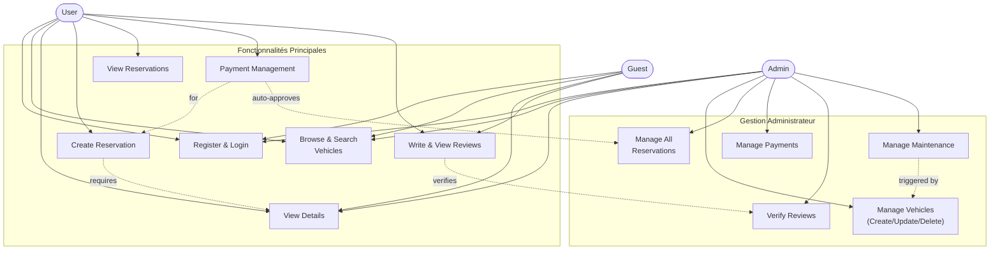

```mermaid
graph TB
    Guest([Guest])
    User([User])
    Admin([Admin])
    
    subgraph Core["Fonctionnalités Principales"]
        UC1["Register & Login"]
        UC2["Browse & Search<br/>Vehicles"]
        UC3["View Details"]
        UC4["Create Reservation"]
        UC5["View Reservations"]
        UC6["Payment Management"]
        UC7["Write & View Reviews"]
    end
    
    subgraph AdminFeatures["Gestion Administrateur"]
        UC8["Manage Vehicles<br/>(Create/Update/Delete)"]
        UC9["Manage All<br/>Reservations"]
        UC10["Manage Payments"]
        UC11["Verify Reviews"]
        UC12["Manage Maintenance"]
    end
    
    Guest --> UC1
    Guest --> UC2
    Guest --> UC3
    Guest --> UC7
    
    User --> UC1
    User --> UC2
    User --> UC3
    User --> UC4
    User --> UC5
    User --> UC6
    User --> UC7
    
    Admin --> UC1
    Admin --> UC2
    Admin --> UC3
    Admin --> UC8
    Admin --> UC9
    Admin --> UC10
    Admin --> UC11
    Admin --> UC12
    
    UC4 -.->|requires| UC3
    UC6 -.->|for| UC4
    UC6 -.->|auto-approves| UC9
    UC7 -.->|verifies| UC11
    UC12 -.->|triggered by| UC8
```
