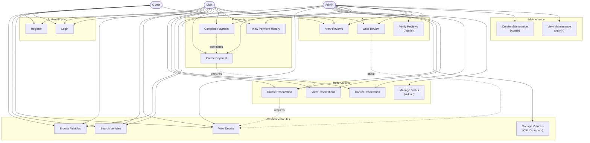

```mermaid
graph TB
    Guest([Guest])
    User([User])
    Admin([Admin])
    
    subgraph Auth["Authentification"]
        UC1["Register"]
        UC2["Login"]
    end
    
    subgraph VehicleOps["Gestion Véhicules"]
        UC3["Browse Vehicles"]
        UC4["Search Vehicles"]
        UC5["View Details"]
        UC6["Manage Vehicles<br/>(CRUD - Admin)"]
    end
    
    subgraph Reservations["Réservations"]
        UC7["Create Reservation"]
        UC8["View Reservations"]
        UC9["Cancel Reservation"]
        UC10["Manage Status<br/>(Admin)"]
    end
    
    subgraph Payments["Paiements"]
        UC11["Create Payment"]
        UC12["Complete Payment"]
        UC13["View Payment History"]
    end
    
    subgraph Reviews["Avis"]
        UC14["View Reviews"]
        UC15["Write Review"]
        UC16["Verify Reviews<br/>(Admin)"]
    end
    
    subgraph Maintenance["Maintenance"]
        UC17["Create Maintenance<br/>(Admin)"]
        UC18["View Maintenance<br/>(Admin)"]
    end
    
    Guest --> UC1
    Guest --> UC2
    Guest --> UC3
    Guest --> UC4
    Guest --> UC5
    Guest --> UC14
    
    User --> UC1
    User --> UC2
    User --> UC3
    User --> UC4
    User --> UC5
    User --> UC7
    User --> UC8
    User --> UC9
    User --> UC11
    User --> UC12
    User --> UC13
    User --> UC14
    User --> UC15
    
    Admin --> UC2
    Admin --> UC3
    Admin --> UC4
    Admin --> UC5
    Admin --> UC6
    Admin --> UC7
    Admin --> UC8
    Admin --> UC9
    Admin --> UC10
    Admin --> UC11
    Admin --> UC12
    Admin --> UC13
    Admin --> UC14
    Admin --> UC15
    Admin --> UC16
    Admin --> UC17
    Admin --> UC18
    
    UC7 -.->|requires| UC5
    UC11 -.->|requires| UC7
    UC12 -.->|completes| UC11
    UC15 -.->|about| UC5
```
