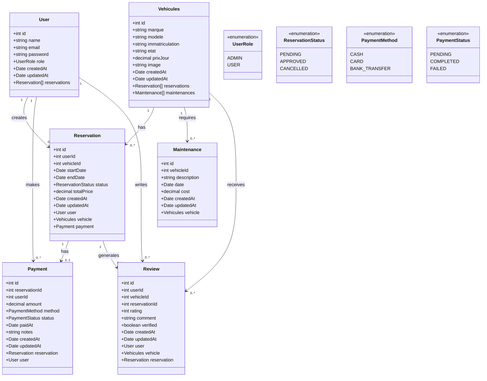

# Class Diagram - Vehicle Rental Management System

## Entity Relationship Diagram

## Detailed Entity Descriptions

### User Entity
**Purpose:** Manages user accounts and authentication

**Attributes:**
- `id`: Primary key (auto-generated)
- `name`: User's full name (max 150 chars)
- `email`: Unique email address for authentication
- `password`: Hashed password (bcrypt, select: false)
- `role`: User role (ADMIN | USER, default: USER)
- `createdAt`: Account creation timestamp
- `updatedAt`: Last profile update timestamp

**Relationships:**
- One-to-Many with Reservation (a user can have multiple reservations)
- One-to-Many with Payment (a user can make multiple payments)
- One-to-Many with Review (a user can write multiple reviews)

**Business Rules:**
- Email must be unique
- Password must be at least 6 characters
- Default role is USER

---

### Vehicules Entity
**Purpose:** Manages vehicle inventory and specifications

**Attributes:**
- `id`: Primary key (auto-generated)
- `marque`: Vehicle brand (max 100 chars)
- `modele`: Vehicle model (max 100 chars)
- `immatriculation`: Unique registration number (max 50 chars)
- `etat`: Vehicle state/condition (max 50 chars)
- `prixJour`: Daily rental price (numeric, 2 decimal places)
- `image`: Vehicle image URL (max 255 chars, nullable)
- `createdAt`: Vehicle added timestamp
- `updatedAt`: Last update timestamp

**Relationships:**
- One-to-Many with Reservation (a vehicle can be reserved multiple times)
- One-to-Many with Maintenance (a vehicle can have multiple maintenance records)
- One-to-Many with Review (a vehicle can receive multiple reviews)

**Business Rules:**
- Immatriculation must be unique
- Cannot be reserved if already booked for overlapping dates
- Price must be positive

---

### Reservation Entity
**Purpose:** Manages vehicle booking and rental periods

**Attributes:**
- `id`: Primary key (auto-generated)
- `userId`: Foreign key to User
- `vehicleId`: Foreign key to Vehicules
- `startDate`: Reservation start date/time (timestamptz)
- `endDate`: Reservation end date/time (timestamptz)
- `status`: Reservation status (PENDING | APPROVED | CANCELLED)
- `totalPrice`: Auto-calculated total cost (numeric, 2 decimal places)
- `createdAt`: Reservation creation timestamp
- `updatedAt`: Last status update timestamp

**Relationships:**
- Many-to-One with User (belongs to a user)
- Many-to-One with Vehicules (reserves a vehicle)
- One-to-One with Payment (has one payment)
- One-to-Many with Review (can generate reviews)

**Business Rules:**
- startDate must be before endDate
- totalPrice = (endDate - startDate in days) × vehicle.prixJour
- Cannot overlap with existing PENDING/APPROVED reservations for same vehicle
- Status starts as PENDING
- Auto-approved when payment is COMPLETED

---

### Payment Entity
**Purpose:** Tracks payment processing for reservations

**Attributes:**
- `id`: Primary key (auto-generated)
- `reservationId`: Foreign key to Reservation (unique)
- `userId`: Foreign key to User (who paid)
- `amount`: Payment amount (numeric, 2 decimal places)
- `method`: Payment method (CASH | CARD | BANK_TRANSFER, default: CASH)
- `status`: Payment status (PENDING | COMPLETED | FAILED, default: PENDING)
- `paidAt`: Payment completion timestamp (nullable)
- `notes`: Additional payment notes (text, nullable)
- `createdAt`: Payment record creation timestamp
- `updatedAt`: Last status update timestamp

**Relationships:**
- One-to-One with Reservation (payment for one reservation)
- Many-to-One with User (user who made the payment)

**Business Rules:**
- Amount must match reservation.totalPrice
- Only one payment per reservation
- Cannot complete payment if already completed
- Auto-approves reservation when status becomes COMPLETED

---

### Maintenance Entity
**Purpose:** Tracks vehicle service and maintenance history

**Attributes:**
- `id`: Primary key (auto-generated)
- `vehicleId`: Foreign key to Vehicules
- `description`: Maintenance description (max 255 chars)
- `date`: Maintenance date (timestamptz)
- `cost`: Maintenance cost (numeric, 2 decimal places)
- `createdAt`: Record creation timestamp
- `updatedAt`: Last update timestamp

**Relationships:**
- Many-to-One with Vehicules (maintenance for a vehicle)

**Business Rules:**
- Cost must be positive
- Vehicle must exist
- Admin-only access

---

### Review Entity
**Purpose:** Manages user reviews and ratings for vehicles

**Attributes:**
- `id`: Primary key (auto-generated)
- `userId`: Foreign key to User (reviewer)
- `vehicleId`: Foreign key to Vehicules (reviewed vehicle)
- `reservationId`: Foreign key to Reservation (optional, nullable)
- `rating`: Star rating (integer, 1-5)
- `comment`: Review text (text, nullable)
- `verified`: Admin verification flag (boolean, default: false)
- `createdAt`: Review creation timestamp
- `updatedAt`: Last edit timestamp

**Relationships:**
- Many-to-One with User (reviewer)
- Many-to-One with Vehicules (reviewed vehicle)
- Many-to-One with Reservation (optional link to rental experience)

**Business Rules:**
- One review per user per vehicle
- Rating must be between 1 and 5
- Can optionally link to a completed reservation
- Only verified reviews count towards average rating

---

## Database Relationships Summary

### One-to-Many Relationships
1. **User → Reservation**: A user can create multiple reservations
2. **User → Payment**: A user can make multiple payments
3. **User → Review**: A user can write multiple reviews
4. **Vehicules → Reservation**: A vehicle can be reserved multiple times
5. **Vehicules → Maintenance**: A vehicle can have multiple maintenance records
6. **Vehicules → Review**: A vehicle can receive multiple reviews

### One-to-One Relationships
1. **Reservation → Payment**: Each reservation has exactly one payment

### Cascade Operations
- **User deletion**: Cascades to all user's reservations, payments, and reviews
- **Vehicules deletion**: Cascades to all vehicle's reservations, maintenance, and reviews
- **Reservation deletion**: Cascades to payment, sets review.reservationId to NULL

---

## Key Design Patterns

### 1. Separation of Concerns
- **Entities**: Pure data models with TypeORM decorators
- **DTOs**: Validation and transformation layer
- **Services**: Business logic and data access
- **Controllers**: HTTP routing and request handling

### 2. Repository Pattern
- TypeORM repositories injected into services
- Abstraction of database operations
- Query builders for complex queries

### 3. Guard Pattern
- RolesGuard for authorization
- Applied globally via APP_GUARD
- Metadata-based role checking

### 4. DTO Validation Pattern
- class-validator decorators on DTOs
- Global ValidationPipe with whitelist
- Type transformation and sanitization

---

Generated: January 2, 2026
