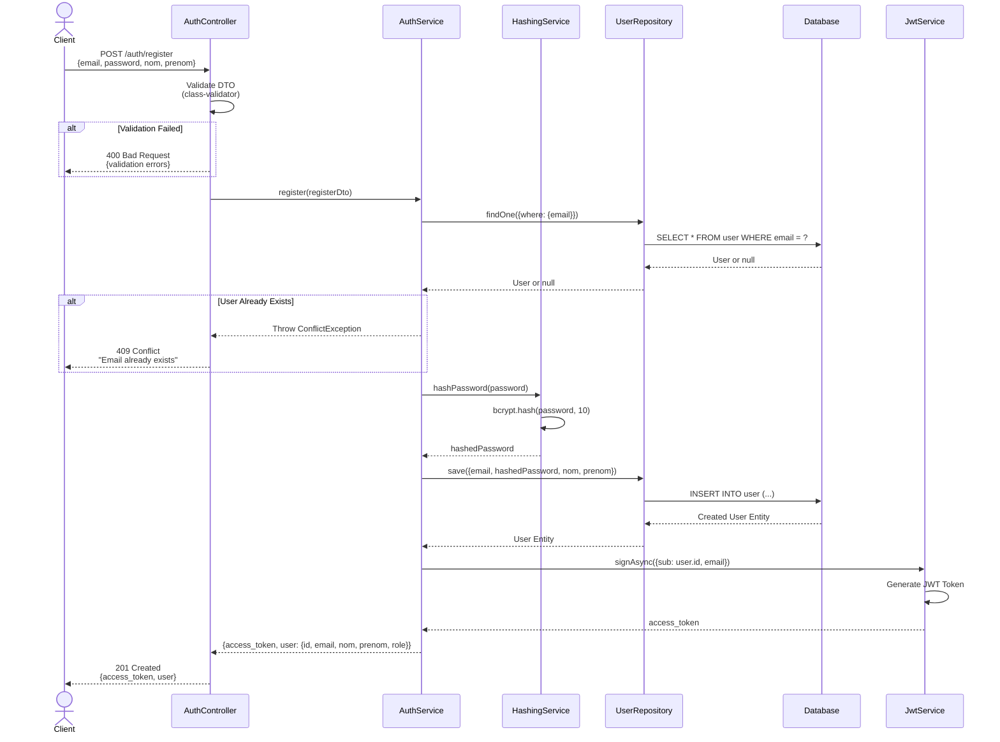
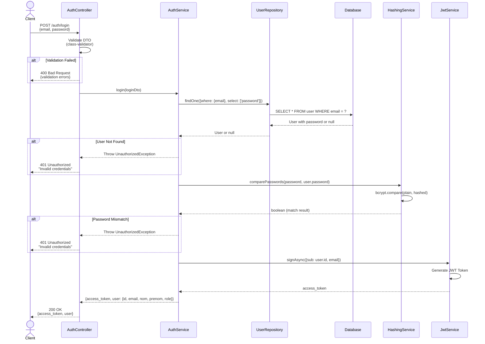
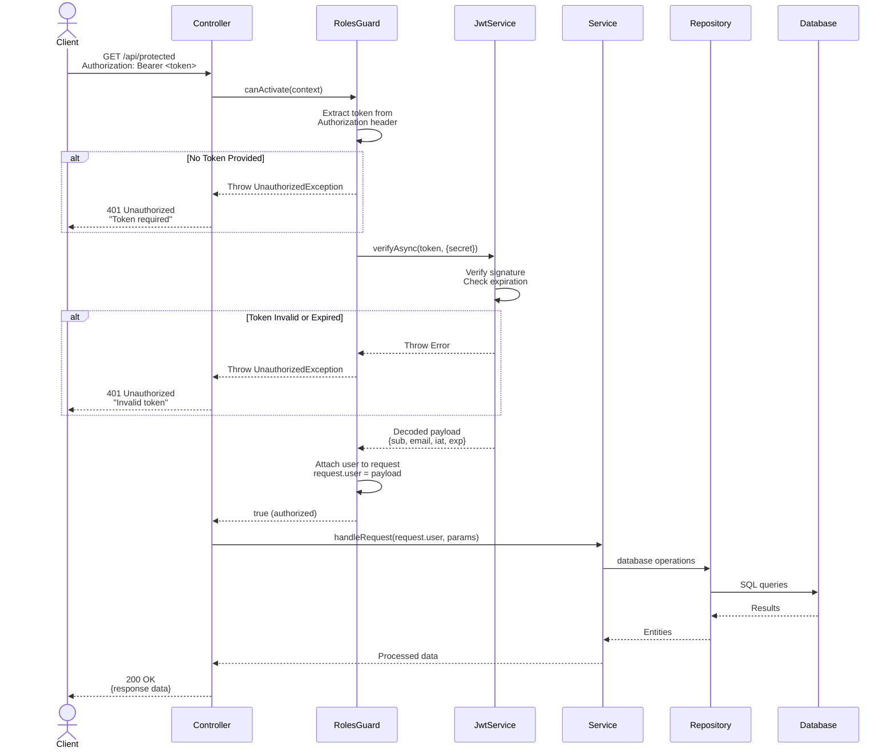
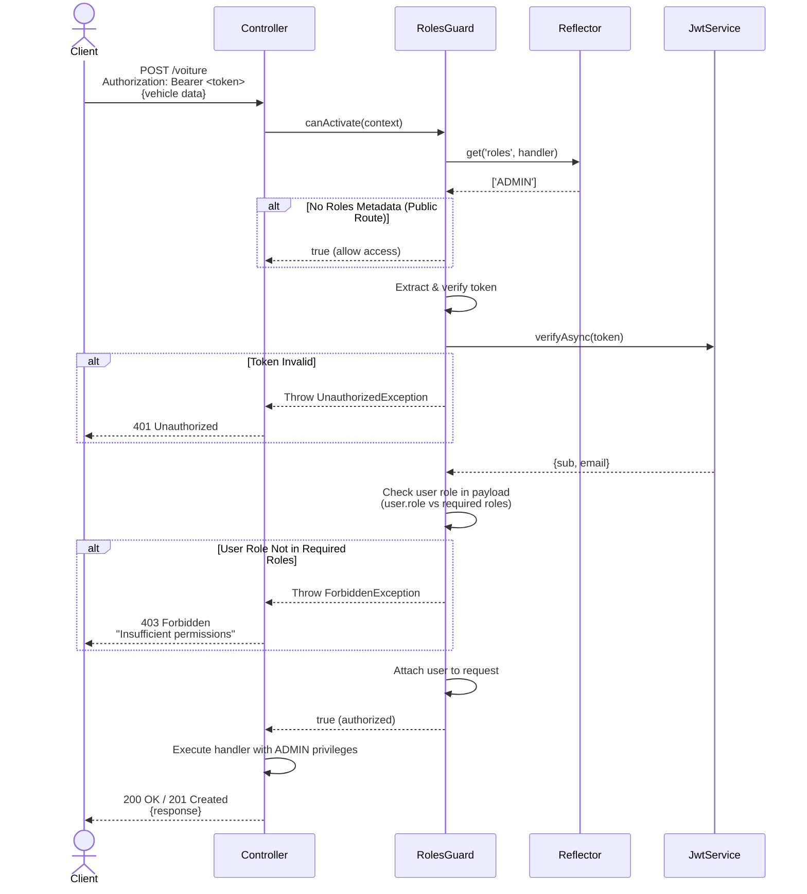

# Sequence Diagrams - Authentication & Authorization

This document provides detailed sequence diagrams for the authentication and authorization flows in the Vehicle Rental System.

## Table of Contents
1. [User Registration Flow](#1-user-registration-flow)
2. [User Login Flow](#2-user-login-flow)
3. [Protected Endpoint Access Flow](#3-protected-endpoint-access-flow)
4. [RBAC Authorization Flow](#4-rbac-authorization-flow)

---

## 1. User Registration Flow

This diagram shows the complete flow when a new user registers in the system.



### Key Steps:
1. **Validation**: DTO validation using class-validator decorators
2. **Duplicate Check**: Verify email doesn't already exist
3. **Password Hashing**: Bcrypt hashing with salt rounds = 10
4. **User Creation**: Save new user to database (default role: USER)
5. **Token Generation**: Create JWT with user.id and email as payload
6. **Response**: Return token and user profile (password excluded)

### Error Scenarios:
- **400 Bad Request**: Invalid email format, missing fields, weak password
- **409 Conflict**: Email already registered
- **500 Internal Server Error**: Database or hashing service failure

---

## 2. User Login Flow

This diagram shows the authentication flow when a user logs in.



### Key Steps:
1. **Validation**: DTO validation for email and password
2. **User Lookup**: Find user by email with password field included
3. **Password Verification**: Compare plain password with hashed password
4. **Token Generation**: Create JWT token on successful authentication
5. **Response**: Return token and user profile

### Error Scenarios:
- **400 Bad Request**: Missing email or password
- **401 Unauthorized**: User not found or incorrect password
- **500 Internal Server Error**: Database or service failure

### Security Notes:
- Generic error message "Invalid credentials" prevents user enumeration
- Password field excluded by default from queries (select: false)
- Bcrypt comparison is time-constant to prevent timing attacks

---

## 3. Protected Endpoint Access Flow

This diagram shows how protected endpoints validate JWT tokens and authorize requests.



### Key Steps:
1. **Token Extraction**: Get JWT from Authorization header (Bearer scheme)
2. **Token Verification**: Validate signature and check expiration
3. **User Attachment**: Decode payload and attach to request object
4. **Business Logic**: Execute controller/service logic with user context
5. **Response**: Return requested data

### Error Scenarios:
- **401 Unauthorized**: Missing token, invalid token, expired token
- **403 Forbidden**: Valid token but insufficient permissions (see RBAC flow)

---

## 4. RBAC Authorization Flow

This diagram shows role-based access control for admin-only endpoints.



### Key Steps:
1. **Metadata Check**: Reflector checks @Roles() decorator on handler
2. **Public Route**: If no roles specified, allow access without token
3. **Token Verification**: Validate JWT token
4. **Role Comparison**: Check if user.role matches required roles
5. **Authorization**: Grant or deny access based on role

### Role Hierarchy:
- **ADMIN**: Full access to all endpoints (CRUD all resources)
- **USER**: Access to own resources (reservations, payments, reviews)
- **Guest**: Public routes only (browse vehicles, view details)

### Protected Endpoints by Role:
| Endpoint | Method | Required Role | Description |
|----------|--------|---------------|-------------|
| POST /voiture | POST | ADMIN | Create vehicle |
| PATCH /voiture/:id | PATCH | ADMIN | Update vehicle |
| DELETE /voiture/:id | DELETE | ADMIN | Delete vehicle |
| POST /maintenance | POST | ADMIN | Create maintenance record |
| GET /user | GET | ADMIN | List all users |
| PATCH /review/:id/verify | PATCH | ADMIN | Verify review |
| POST /reservation | POST | USER | Create reservation |
| PATCH /payment/:id/complete | PATCH | USER | Complete payment |
| POST /review | POST | USER | Write review |

### Error Scenarios:
- **401 Unauthorized**: No token provided or invalid token
- **403 Forbidden**: Valid token but insufficient role permissions

---

## Authentication & Authorization Summary

### Security Features:
1. **Password Security**: Bcrypt hashing with 10 salt rounds
2. **Token-Based Auth**: JWT with configurable expiration
3. **Global Guard**: RolesGuard applied to all routes via APP_GUARD
4. **Role-Based Access**: Three-tier permission system (Guest, USER, ADMIN)
5. **Request Context**: User information attached to request object for service layer
6. **Password Exclusion**: Password field never returned in responses (select: false)

### Token Structure:
```json
{
  "sub": 123,
  "email": "user@example.com",
  "iat": 1704240000,
  "exp": 1704326400
}
```

### Best Practices Implemented:
- ✅ Generic error messages to prevent user enumeration
- ✅ Time-constant password comparison
- ✅ JWT secret stored in environment variables
- ✅ Global validation pipe with whitelist enabled
- ✅ Role metadata using decorators for clean code
- ✅ Separation of concerns (guard handles auth, service handles business logic)

---

## Related Documentation
- [README.md](../README.md) - Project overview and setup
- [Class Diagram](./class-diagram.md) - Entity relationships
- [Use Cases](./use-case.md) - Functional requirements
- [API Documentation](../API_DOCUMENTATION.md) - Endpoint reference
