# Use Case Diagram - Vehicle Rental Management System

## Global Use Case Overview

```mermaid
graph TB
    subgraph "Vehicle Rental Management System"
        subgraph "Authentication"
            UC1[Register Account]
            UC2[Login]
        end
        
        subgraph "Vehicle Management"
            UC3[Browse Vehicles]
            UC4[Search Vehicles]
            UC5[View Vehicle Details]
            UC6[Manage Vehicles]
            UC7[View Vehicle Reviews]
        end
        
        subgraph "Reservation Management"
            UC8[Create Reservation]
            UC9[View Reservations]
            UC10[Cancel Reservation]
            UC11[Manage Reservation Status]
        end
        
        subgraph "Payment Management"
            UC12[Create Payment]
            UC13[Complete Payment]
            UC14[View Payment History]
        end
        
        subgraph "Review Management"
            UC15[Write Review]
            UC16[Edit Own Review]
            UC17[Verify Reviews]
        end
        
        subgraph "Maintenance Management"
            UC18[Create Maintenance Record]
            UC19[View Maintenance History]
            UC20[Update Maintenance]
        end
        
        subgraph "User Management"
            UC21[View Profile]
            UC22[View All Users]
        end
    end
    
    Guest([Guest])
    User([User])
    Admin([Administrator])
    
    %% Guest interactions
    Guest --> UC1
    Guest --> UC2
    Guest --> UC3
    Guest --> UC4
    Guest --> UC5
    Guest --> UC7
    
    %% User interactions
    User --> UC2
    User --> UC3
    User --> UC4
    User --> UC5
    User --> UC7
    User --> UC8
    User --> UC9
    User --> UC10
    User --> UC12
    User --> UC13
    User --> UC14
    User --> UC15
    User --> UC16
    User --> UC21
    
    %% Admin interactions
    Admin --> UC2
    Admin --> UC3
    Admin --> UC4
    Admin --> UC5
    Admin --> UC6
    Admin --> UC7
    Admin --> UC8
    Admin --> UC9
    Admin --> UC10
    Admin --> UC11
    Admin --> UC12
    Admin --> UC13
    Admin --> UC14
    Admin --> UC15
    Admin --> UC16
    Admin --> UC17
    Admin --> UC18
    Admin --> UC19
    Admin --> UC20
    Admin --> UC21
    Admin --> UC22
```



## Actors

### 1. Guest (Unauthenticated User)
**Description:** A visitor to the system who has not yet logged in.

**Capabilities:**
- Register a new account
- Login to existing account
- Browse available vehicles
- Search vehicles with filters
- View vehicle details
- View vehicle reviews

**Limitations:**
- Cannot make reservations
- Cannot write reviews
- Cannot access payment features

---

### 2. User (Authenticated Regular User)
**Description:** A registered user with a USER role.

**Capabilities:**
- All Guest capabilities
- Create reservations for themselves
- View their own reservations
- Cancel their own reservations
- Create payments for their reservations
- Mark their payments as complete
- View their payment history
- Write reviews for vehicles
- Edit their own reviews
- View their own profile

**Limitations:**
- Cannot manage other users' data
- Cannot manage vehicles
- Cannot approve reservations
- Cannot verify reviews
- Cannot manage maintenance records

---

### 3. Administrator (Admin User)
**Description:** A privileged user with an ADMIN role.

**Capabilities:**
- All User capabilities
- Full vehicle CRUD operations
- Create reservations for any user
- View all reservations
- Approve/reject reservations
- Manage reservation status
- View all payments
- Create maintenance records
- View and update maintenance history
- Verify user reviews
- View all users with pagination

**Limitations:**
- None (full system access)

---

## Detailed Use Cases

## UC1: Register Account

**Primary Actor:** Guest  
**Goal:** Create a new user account  
**Preconditions:** None  
**Postconditions:** New user account created with USER role and JWT token returned

### Main Success Scenario:
1. Guest provides name, email, and password
2. System validates input format (email valid, password min 6 chars)
3. System checks email uniqueness
4. System hashes password with bcrypt
5. System creates user with default USER role
6. System generates JWT token
7. System returns success with token and user ID

### Alternative Flows:

**2a. Invalid input:**
- System returns 400 Bad Request with validation errors
- Use case ends

**3a. Email already exists:**
- System returns 400 Bad Request with "Email already in use" error
- Use case ends

### Business Rules:
- Email must be unique
- Password minimum length: 6 characters
- Default role is always USER
- Admin accounts must be created manually in database

---

## UC2: Login

**Primary Actor:** Guest, User, Admin  
**Goal:** Authenticate and receive access token  
**Preconditions:** User has registered account  
**Postconditions:** User receives valid JWT token

### Main Success Scenario:
1. Actor provides email and password
2. System validates input format
3. System finds user by email
4. System compares provided password with stored hash
5. System generates JWT token with userId, username, role
6. System returns token

### Alternative Flows:

**3a. User not found:**
- System returns 400 Bad Request with "Invalid credentials"
- Use case ends

**4a. Password mismatch:**
- System returns 400 Bad Request with "Invalid credentials"
- Use case ends

### Security Notes:
- Password field excluded from normal queries (select: false)
- Generic error message prevents email enumeration
- Token expires based on JWT configuration

---

## UC3: Browse Vehicles

**Primary Actor:** Guest, User, Admin  
**Goal:** View list of available vehicles with pagination  
**Preconditions:** None  
**Postconditions:** List of vehicles displayed

### Main Success Scenario:
1. Actor requests vehicle list
2. System applies default pagination (page=1, limit=10)
3. System retrieves vehicles ordered by creation date
4. System returns data with pagination metadata

### Alternative Flows:

**2a. Custom pagination requested:**
- Actor specifies page and limit (max 100)
- System applies custom pagination
- Continue with step 3

**2b. Filters applied:**
- Actor provides search term (marque/modele)
- Actor specifies etat filter
- Actor specifies price range (minPrice, maxPrice)
- System applies filters to query
- Continue with step 3

### Response Format:
```json
{
  "data": [...],
  "meta": {
    "page": 1,
    "limit": 10,
    "total": 45,
    "totalPages": 5
  }
}
```

---

## UC4: Search Vehicles

**Primary Actor:** Guest, User, Admin  
**Goal:** Find specific vehicles using search filters  
**Preconditions:** None  
**Postconditions:** Filtered vehicle list displayed

### Main Success Scenario:
1. Actor provides search criteria
2. System validates query parameters
3. System builds query with filters:
   - Text search on marque/modele (case-insensitive)
   - Exact match on etat
   - Price range (minPrice, maxPrice)
4. System applies pagination
5. System returns filtered results

### Search Examples:
- `?search=Toyota` - Find all Toyota vehicles
- `?etat=available&minPrice=30&maxPrice=100` - Available vehicles $30-$100/day
- `?search=corolla&page=2&limit=5` - Second page of Corolla results

---

## UC5: View Vehicle Details

**Primary Actor:** Guest, User, Admin  
**Goal:** View detailed information about a specific vehicle  
**Preconditions:** Vehicle exists  
**Postconditions:** Vehicle details displayed

### Main Success Scenario:
1. Actor requests vehicle by ID
2. System validates ID format
3. System retrieves vehicle details
4. System returns vehicle data

### Alternative Flows:

**3a. Vehicle not found:**
- System returns 404 Not Found
- Use case ends

---

## UC6: Manage Vehicles (CRUD)

**Primary Actor:** Admin  
**Goal:** Create, update, or delete vehicles  
**Preconditions:** User has ADMIN role  
**Postconditions:** Vehicle inventory updated

### Main Success Scenario - Create:
1. Admin provides vehicle data
2. System validates all fields
3. System checks immatriculation uniqueness
4. System creates vehicle record
5. System returns created vehicle

### Main Success Scenario - Update:
1. Admin provides vehicle ID and update data
2. System validates ID and update fields
3. System checks immatriculation uniqueness (if changed)
4. System updates vehicle using preload
5. System returns updated vehicle

### Main Success Scenario - Delete:
1. Admin provides vehicle ID
2. System validates ID
3. System deletes vehicle
4. System cascades to related records (reservations, reviews, maintenance)
5. System returns success message

### Alternative Flows:

**3a. Duplicate immatriculation:**
- System returns 400 Bad Request
- Use case ends

**3b. Vehicle not found (Update/Delete):**
- System returns 404 Not Found
- Use case ends

---

## UC8: Create Reservation

**Primary Actor:** User, Admin  
**Goal:** Book a vehicle for specific dates  
**Preconditions:** User authenticated, Vehicle exists and available  
**Postconditions:** Reservation created with PENDING status

### Main Success Scenario:
1. Actor provides vehicleId, startDate, endDate
2. System validates date format and range
3. System verifies startDate < endDate
4. System checks vehicle existence
5. System checks user existence (if admin creating for another user)
6. System checks for date conflicts with existing reservations
7. System calculates totalPrice: (endDate - startDate in days) × vehicle.prixJour
8. System creates reservation with status PENDING
9. System returns reservation details

### Alternative Flows:

**2a. Invalid date format:**
- System returns 400 Bad Request
- Use case ends

**3a. Start date not before end date:**
- System returns 400 Bad Request with "startDate must be before endDate"
- Use case ends

**4a. Vehicle not found:**
- System returns 404 Not Found
- Use case ends

**6a. Date conflict detected:**
- System finds overlapping PENDING/APPROVED reservation
- System returns 400 Bad Request with "Vehicle already reserved for selected dates"
- Use case ends

### Business Rules:
- Price auto-calculated based on duration
- Conflicts only checked for PENDING/APPROVED (not CANCELLED)
- CANCELLED reservations don't block dates
- Users can only create for themselves unless ADMIN

---

## UC9: View Reservations

**Primary Actor:** User, Admin  
**Goal:** View reservation list  
**Preconditions:** User authenticated  
**Postconditions:** Reservation list displayed

### Main Success Scenario:
1. Actor requests reservation list
2. System applies pagination
3. System applies actor-based filtering:
   - USER: Only their own reservations
   - ADMIN: All reservations
4. System applies optional status filter
5. System loads related entities (vehicle, user)
6. System returns reservations with metadata

### Alternative Flows:

**4a. Status filter applied:**
- Actor specifies status (PENDING/APPROVED/CANCELLED)
- System filters by status
- Continue with step 6

---

## UC10: Cancel Reservation

**Primary Actor:** User, Admin  
**Goal:** Cancel an existing reservation  
**Preconditions:** Reservation exists  
**Postconditions:** Reservation status changed to CANCELLED

### Main Success Scenario:
1. Actor provides reservation ID
2. System validates ID
3. System retrieves reservation
4. System checks authorization:
   - USER: Must own the reservation
   - ADMIN: Can cancel any
5. System updates status to CANCELLED
6. System returns updated reservation

### Alternative Flows:

**3a. Reservation not found:**
- System returns 404 Not Found
- Use case ends

**4a. Authorization failed:**
- User trying to cancel other's reservation
- System returns 403 Forbidden
- Use case ends

---

## UC11: Manage Reservation Status

**Primary Actor:** Admin  
**Goal:** Update reservation status (approve/reject)  
**Preconditions:** User has ADMIN role, Reservation exists  
**Postconditions:** Reservation status updated

### Main Success Scenario:
1. Admin provides reservation ID and new status
2. System validates inputs
3. System retrieves reservation
4. System updates status (PENDING → APPROVED or CANCELLED)
5. System returns updated reservation

### Alternative Flows:

**3a. Reservation not found:**
- System returns 404 Not Found
- Use case ends

---

## UC12: Create Payment

**Primary Actor:** User, Admin  
**Goal:** Create payment record for a reservation  
**Preconditions:** User authenticated, Reservation exists  
**Postconditions:** Payment record created with PENDING status

### Main Success Scenario:
1. Actor provides reservationId, amount, optional method
2. System validates inputs
3. System retrieves reservation
4. System checks authorization (user owns reservation or is admin)
5. System checks for existing completed payment
6. System validates amount matches reservation.totalPrice
7. System creates payment with PENDING status
8. System returns payment record

### Alternative Flows:

**3a. Reservation not found:**
- System returns 404 Not Found
- Use case ends

**5a. Payment already completed:**
- System returns 400 Bad Request
- Use case ends

**6a. Amount mismatch:**
- System returns 400 Bad Request with expected amount
- Use case ends

---

## UC13: Complete Payment

**Primary Actor:** User, Admin  
**Goal:** Mark payment as completed  
**Preconditions:** Payment exists with PENDING status  
**Postconditions:** Payment status COMPLETED, Reservation auto-approved

### Main Success Scenario:
1. Actor provides payment ID and optional notes
2. System validates ID
3. System retrieves payment
4. System checks authorization
5. System updates payment:
   - status = COMPLETED
   - paidAt = current timestamp
   - notes = provided notes
6. System saves payment
7. System retrieves linked reservation
8. System auto-approves reservation if status was PENDING
9. System returns updated payment

### Alternative Flows:

**3a. Payment not found:**
- System returns 404 Not Found
- Use case ends

**4a. Authorization failed:**
- System returns 403 Forbidden
- Use case ends

### Business Rules:
- Payment completion triggers automatic reservation approval
- paidAt timestamp recorded for audit trail

---

## UC14: View Payment History

**Primary Actor:** User, Admin  
**Goal:** View list of payments  
**Preconditions:** User authenticated  
**Postconditions:** Payment list displayed

### Main Success Scenario:
1. Actor requests payment list
2. System applies pagination
3. System applies actor-based filtering:
   - USER: Only their payments
   - ADMIN: All payments
4. System applies optional filters (status, reservationId)
5. System loads related entities
6. System returns payments with metadata

---

## UC15: Write Review

**Primary Actor:** User, Admin  
**Goal:** Create a review for a vehicle  
**Preconditions:** User authenticated, Vehicle exists  
**Postconditions:** Review created with verified=false

### Main Success Scenario:
1. Actor provides vehicleId, rating (1-5), optional comment, optional reservationId
2. System validates inputs
3. System checks vehicle existence
4. System checks reservation ownership (if provided)
5. System checks for duplicate review (same user + vehicle)
6. System creates review with verified=false
7. System returns created review

### Alternative Flows:

**3a. Vehicle not found:**
- System returns 404 Not Found
- Use case ends

**4a. Reservation ownership invalid:**
- System returns 400 Bad Request
- Use case ends

**5a. Duplicate review:**
- System returns 400 Bad Request with "Already reviewed"
- Use case ends

### Business Rules:
- One review per user per vehicle
- Rating must be 1-5
- New reviews start unverified

---

## UC16: Edit Own Review

**Primary Actor:** User, Admin  
**Goal:** Update an existing review  
**Preconditions:** User owns the review  
**Postconditions:** Review updated

### Main Success Scenario:
1. Actor provides review ID and updates (rating, comment)
2. System validates inputs
3. System retrieves review
4. System checks ownership
5. System updates review fields
6. System returns updated review

### Alternative Flows:

**4a. Ownership check fails:**
- System returns 403 Forbidden
- Use case ends

---

## UC17: Verify Reviews

**Primary Actor:** Admin  
**Goal:** Mark a review as verified  
**Preconditions:** User has ADMIN role  
**Postconditions:** Review marked as verified

### Main Success Scenario:
1. Admin provides review ID
2. System validates ID
3. System retrieves review
4. System sets verified = true
5. System returns updated review

### Business Rules:
- Only verified reviews count toward average rating
- Only admins can verify reviews

---

## UC18: Create Maintenance Record

**Primary Actor:** Admin  
**Goal:** Add maintenance record for a vehicle  
**Preconditions:** User has ADMIN role, Vehicle exists  
**Postconditions:** Maintenance record created

### Main Success Scenario:
1. Admin provides vehicleId, description, date, cost
2. System validates inputs
3. System checks vehicle existence
4. System creates maintenance record
5. System returns created record

### Alternative Flows:

**3a. Vehicle not found:**
- System returns 404 Not Found
- Use case ends

---

## UC19: View Maintenance History

**Primary Actor:** Admin  
**Goal:** View maintenance records with optional vehicle filter  
**Preconditions:** User has ADMIN role  
**Postconditions:** Maintenance list displayed

### Main Success Scenario:
1. Admin requests maintenance list
2. System applies pagination
3. System applies optional vehicleId filter
4. System loads related vehicle data
5. System returns maintenance records with metadata

---

## UC20: Update Maintenance

**Primary Actor:** Admin  
**Goal:** Update existing maintenance record  
**Preconditions:** User has ADMIN role, Maintenance exists  
**Postconditions:** Maintenance record updated

### Main Success Scenario:
1. Admin provides maintenance ID and update data
2. System validates inputs
3. System updates maintenance using preload
4. System returns updated record

### Alternative Flows:

**3a. Maintenance not found:**
- System returns 404 Not Found
- Use case ends

---

## UC21: View Profile

**Primary Actor:** User, Admin  
**Goal:** View own profile information  
**Preconditions:** User authenticated  
**Postconditions:** Profile displayed without password

### Main Success Scenario:
1. Actor requests profile (GET /users/me)
2. System extracts userId from JWT token
3. System retrieves user profile (password excluded)
4. System returns profile data

---

## UC22: View All Users

**Primary Actor:** Admin  
**Goal:** View list of all users with pagination  
**Preconditions:** User has ADMIN role  
**Postconditions:** User list displayed

### Main Success Scenario:
1. Admin requests user list
2. System applies pagination
3. System retrieves users (password excluded)
4. System returns users with metadata

---

## Use Case Priority Matrix

| Priority | Use Cases |
|----------|-----------|
| **Critical** | UC1 (Register), UC2 (Login), UC8 (Create Reservation), UC13 (Complete Payment) |
| **High** | UC3 (Browse), UC4 (Search), UC6 (Manage Vehicles), UC9 (View Reservations) |
| **Medium** | UC10 (Cancel), UC12 (Create Payment), UC15 (Write Review), UC18 (Maintenance) |
| **Low** | UC16 (Edit Review), UC17 (Verify Review), UC19 (View Maintenance), UC22 (View Users) |

---

## Business Flow Examples

### Complete Rental Flow (Happy Path)
1. Guest registers account → UC1
2. User logs in → UC2
3. User browses vehicles → UC3
4. User searches for specific vehicle → UC4
5. User creates reservation → UC8
6. User creates payment → UC12
7. User completes payment → UC13
8. System auto-approves reservation
9. User completes rental
10. User writes review → UC15
11. Admin verifies review → UC17

### Admin Vehicle Management Flow
1. Admin logs in → UC2
2. Admin creates new vehicle → UC6
3. Vehicle used in reservations
4. Admin creates maintenance record → UC18
5. Admin updates vehicle status → UC6

---

Generated: January 2, 2026
